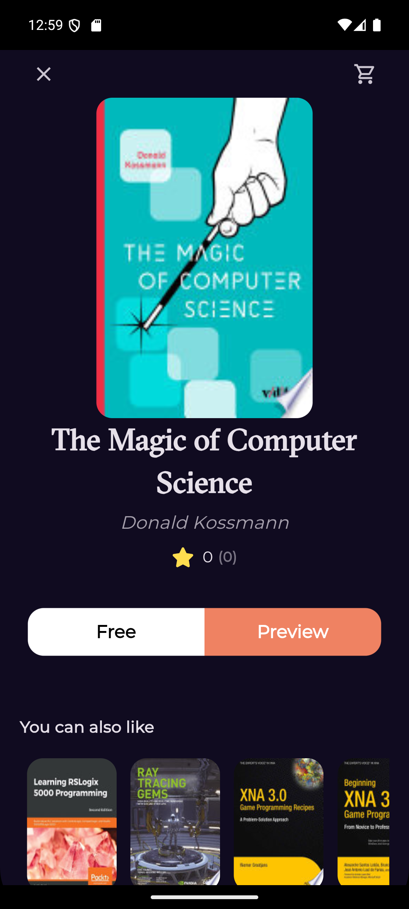

<!DOCTYPE html>
<html lang="en" dir="ltr">
<head>
  <meta charset="UTF-8" />
  <meta name="viewport" content="width=device-width, initial-scale=1" />
  <title>README - Bookly Project</title>
</head>
<body style="font-family: 'Segoe UI', Tahoma, Geneva, Verdana, sans-serif; max-width: 900px; margin: 20px auto; color: #333; line-height: 1.6; background-color: #f9f9f9; padding: 0 15px;">

  <h1 style="color: #1e88e5;">📚 Bookly - Flutter Book Reader App</h1>

  

    
    
    
  

  <h2 style="color: #1e88e5;">Introduction</h2>
  

    Bookly is a Flutter app that lets users browse, search, and read books through direct links.
    The app uses the <strong>MVVM architecture</strong> to keep UI and business logic separated,
    managing state with <strong>Cubit</strong> and fetching book data from REST APIs.
  

  <h2 style="color: #1e88e5;">Features</h2>
  <ul>
    <li>Display a list of books with covers, titles, and authors.</li>
    <li>Search books by title or author.</li>
    <li>Read books via external links.</li>
    <li>Responsive and clean UI with Flutter.</li>
    <li>State management using Cubit.</li>
    <li>Dynamic data loading with API integration.</li>
  </ul>

  <h2 style="color: #1e88e5;">Project Structure</h2>
  
The project structure follows MVVM without a separate domain layer:

  <pre style="background:#eee; padding:15px; border-radius:6px; overflow-x:auto;">
lib/
├── core/                  # Utilities, constants, reusable widgets
├── feature/
│   └── book/
│       ├── data/
│       │   └── models/    # Book data models
│       ├── presentation/
│       │   ├── cubit/     # Cubit & states for managing logic & state
│       │   └── views/     # UI screens and widgets
│       └── services/      # API calls and networking logic
├── main.dart              # App entry point
pubspec.yaml               # Project dependencies
  </pre>
  
<strong>Folder roles:</strong>

  <ul>
    <li><strong>core/</strong>: shared utilities, constants, and widgets.</li>
    <li><strong>feature/book/data/models/</strong>: data models for books.</li>
    <li><strong>feature/book/presentation/cubit/</strong>: Cubit state managers and states.</li>
    <li><strong>feature/book/presentation/views/</strong>: UI screens and widgets.</li>
    <li><strong>feature/book/services/</strong>: network requests to APIs.</li>
    <li><strong>main.dart</strong>: starts the app.</li>
  </ul>

  <h2 style="color: #1e88e5;">How MVVM with Cubit & API Integration Works</h2>
  <ol>
    <li><strong>View:</strong> Displays UI and listens to Cubit state changes.</li>
    <li><strong>Cubit:</strong> Handles business logic, fetches data from Services, and updates state.</li>
    <li><strong>Services:</strong> Makes API calls and returns parsed data models.</li>
    <li><strong>Cubit:</strong> Emits new states with data or errors.</li>
    <li><strong>View:</strong> Rebuilds UI based on current Cubit state.</li>
  </ol>

  <h2 style="color: #1e88e5;">How to Run</h2>
  
Follow these simple steps to run the Bookly app locally:

  <ol>
    <li><strong>Install Flutter SDK</strong> if you haven't already: <a href="https://flutter.dev/docs/get-started/install" target="_blank" rel="noopener noreferrer" style="color:#1e88e5;">Flutter Installation Guide</a>.</li>
    <li><strong>Clone the repository:</strong> 
      <code style="background:#eee; padding:3px 6px; border-radius:4px;">git clone https://github.com/yourusername/bookly.git</code>
    </li>
    <li><strong>Navigate to the project directory:</strong> 
      <code style="background:#eee; padding:3px 6px; border-radius:4px;">cd bookly</code>
    </li>
    <li><strong>Fetch dependencies:</strong> 
      <code style="background:#eee; padding:3px 6px; border-radius:4px;">flutter pub get</code>
    </li>
    <li><strong>Run the app on an emulator or physical device:</strong> 
      <code style="background:#eee; padding:3px 6px; border-radius:4px;">flutter run</code>
    </li>
  </ol>

  <h2 style="color: #1e88e5;">Usage</h2>
  
Open the app to browse books fetched from API, search by title or author, and read books via provided links.

</body>
</html>
